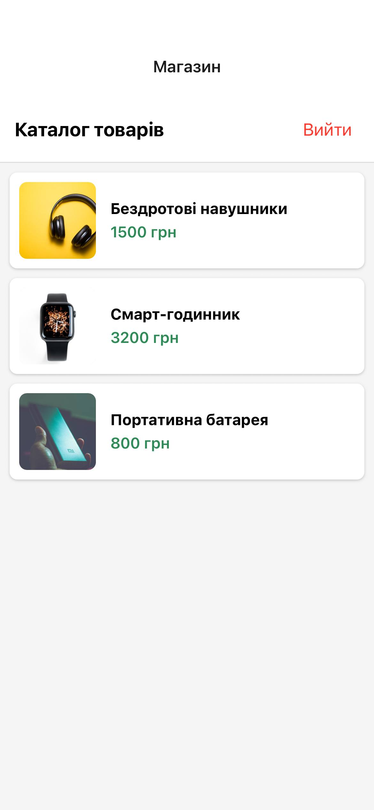
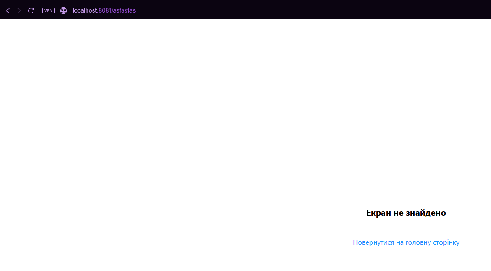

# Лабораторна робота № 5: Побудова навігації у React Native із використанням бібліотеки Ехро Router

## Опис реалізованого функціоналу

У рамках лабораторної роботи було розроблено мобільний застосунок з використанням file-based маршрутизації Expo Router. Застосунок містить наступний функціонал:

- **Глобальний стан авторизації:** Реалізовано за допомогою React Context (`AuthContext`), який керує станом входу користувача.
- **Публічні екрани (Група маршрутів):** Екрани "Вхід" (`/login`) та "Реєстрація" (`/register`), доступні для неавторизованих користувачів.
- **Захищена навігація:** Головний екран каталогу та екран деталей товару доступні лише після авторизації. Перевірка здійснюється на рівні макета (`_layout.jsx`).
- **Динамічні маршрути:** Реалізовано перехід на сторінку конкретного товару за його ідентифікатором (`/details/[id]`) з відображенням динамічних даних.
- **Обробка помилок навігації:** Створено кастомну сторінку 404 (`+not-found.jsx`) для обробки запитів на неіснуючі маршрути.

## Інструкція запуску

Для запуску проєкту на вашому локальному комп'ютері виконайте наступні кроки:

1. Склонуйте репозиторій:

   ```bash
   git clone https://github.com/IgorLomonosov/rmdlab5.git
   ```

2. Перейдіть у директорію проєкту:

   ```bash
   cd lab5
   ```

3. Встановіть залежності:

   ```bash
   npm install
   ```

4. Запустіть проєкт:

   ```bash
   npx expo start
   ```

5. Для перегляду застосунку відскануйте QR-код через додаток Expo Go на вашому смартфоні, або натисніть a для запуску на Android-емуляторі, i для iOS-симулятора, чи w для відкриття у браузері.

## Скріншоти роботи застосунку

### Екран входу


### Екран реєстрації


### Екран каталогу



### Екран товару


### Екран 404


